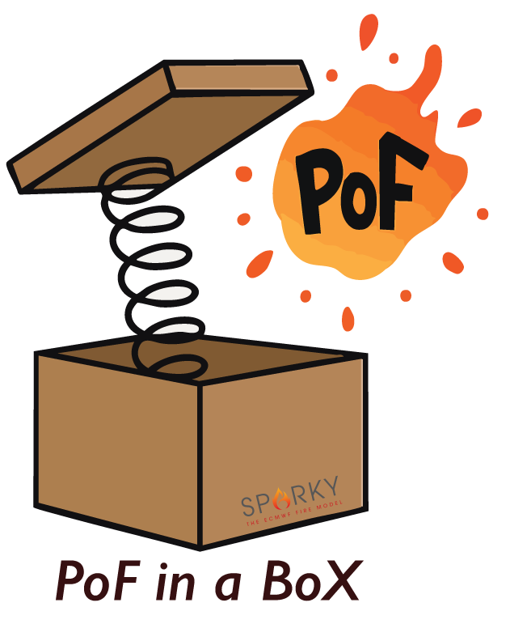

  <picture>
    
  </picture>

# ECMWF - Probability of Fire (POF) Model Pipeline

This repository contains three main scripts representing the end-to-end workflow for generating, training, and forecasting Probability of Fire (POF) using environmental and human
datasets. The model framework is based around the operation Sparky-PoF system used by ECMWF.

Creation of and use of the model can be done in three steps:

1. Data Preperation◊
2. Model Training
3. Model Forecasting

## 1. Data Preperation 

POF_DATA_GENERATOR.py

This script prepares the data for model training by compiling and packaging all required inputs into a single Parquet file.

Current Data Sources
Target: Active Fire — from gridded MODIS data.

Inputs:
Precipitation
Temperature (T2)
Dew Point (D2)
Wind Speed (WS)
Leaf/Wood/Foliage/Deadwood Load
Live Fuel Moisture Content (LFMC)
Dead Fuel Moisture Content (DFMC; Wood/Foliage)
Urban Fraction
Population Density
Road Density

⚠️ Note: All inputs and target must be on the same spatial grid.

Key Considerations
Fuel Type: Ensure access to suitable fuel data or using extisting or climatological data available through ECMWF.
Feature Selection: You can easily modify which predictors are included.
Training Timeline: Defaults to all months of 2003.
Sampling: By default, 1% of grid points containing vegetation are sampled (sample_frac and mask).

## 2. Model Training

POF_TRAINER.py

This script trains the a binary fire occurrence classifier using XGBoost.

1. Reads the Parquet file from the previous step.
2. Randomly splits data: 80% training / 20% validation.
3. Trains an XGBoost binary classifier with standard parameters.

Key Considerations
The dataset is not balanced — probabilities represent true likelihoods rather than forced equal class weighting.
The script produces diagnostic outputs:
Feature importance plot (POF_importance.png)
ROC curve (POF_ROC.png) — optional and can be disabled for performance.
The hyperparameters can and should be adjusted to suit regional needs.

## 3. Model Forecasting

POF_FORECAST.py

This script applies the trained model (POF_model.joblib) to new data to generate monthly Probability of Fire predictions.

Usage
Specify the month and year to forecast (looping over multiple months can be easily added).
Define the data source locations for inputs.
Load the trained model and apply it to produce a gridded forecast.

Output

Produces a NetCDF file:
POF_prediction_<YYYY>_<MM>.nc
containing the fractional probability of fire occurrence for each grid cell.

Key Considerations
Dataformat should match that of step 1 to ensure stable model performance (correct gridding/frequency etc.)
